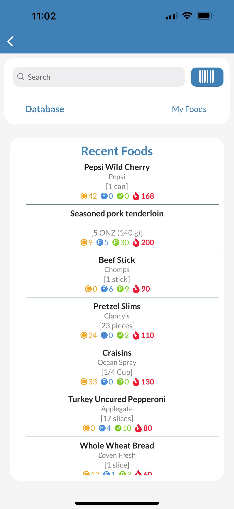

# .NET MAUI HealthMode application (deprecated/moved to React)

I utilized .NET Maui to create a prototype native application for iOS and Android which was entitled HealthMode:

     
     
     
    
    

#
 

This was a simple protoype of a food and weight tracking app, with features for leaderboards/challenges and workouts not added yet.

The app is utilizing an ASP.NET Core Web API connecting to an RDS MSSQL Server DB on AWS which contains 500,000 food records with the required nutritional information.

The user can search through the food list and add a food to a meal at a certain time on a specific date where it is stored in a SQLite Database directly on the users device.

I've made this repo public to showcase what I've done over the course of 2023, but since this is not the production version anymore I figured it may be a good addition to my portfolio!
